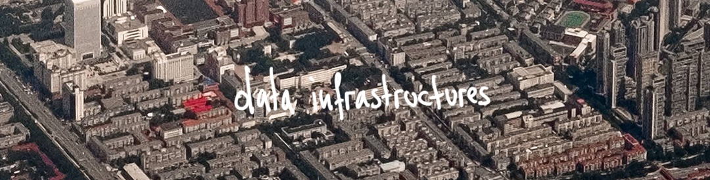

# Critical Data & Visualization Fall 2019

Welcome! This page will be filled with material and links throughout the Semester. I recommend you **bookmark it now**.

- Instructor: Leon Eckert, leon.eckert@nyu.edu
- Class Times: Mondays & Wednesdays, 1:15pm-2:30pm
- Credits: 4
- Room: 824
- Office Hours: Tuesdays, 9am-12pm ([sign up](https://calendar.google.com/calendar/selfsched?sstoken=UUE0X1AyMVlCNnpyfGRlZmF1bHR8ZTBmYjk2MTcyMjZkZmUwMzhjYTllN2IxMzlkMmQ4MTU))

##### Other:

- [Resources](other/resources)

#### Course Description
Data is at the heart of the increasing role technology has in our lives. Data collection and algorithmic processing are not only central to recent technical breakthroughs such as in AI and automation but have created new economic paradigms where data equals value and shape political approaches to power and control.

Decisions based on algorithms affect society at large whether it’s changing the way we transport and distribute goods, or influencing the things we buy, the news we read or even the people we date. The *world* that algorithms *see* is data. For the average person, however, data is seldom more than an abstract idea.

So what exactly is data? How is value extracted from it? And why should we care? How can we ethically balance the positive uses of data-driven systems with the threats they pose to discriminate and infringe basic human rights?
This class seeks to untangle some of these issues practically and theoretically.

[Course Overview and Learning Outcomes](https://github.com/leoneckert/cdv-fall19#course-overview-and-learning-outcomes)

<!-- #### Content
|Week|Class|Lab|
|:-:|---|-|
|**1**|[Mapping the Landscape](#week-1)|Collect Data|
|**2**|[Data Infrastructures](#week-2)|Meet D3js I|
|**3**|[Bias](#week-3)|Meet D3js II|
|**4**|[Prediction and Uncertainty](#week-4)|D3 Scales|
||**Fall Break**||
|**5**|[Concept Review](#week-5)|Old bits, new bits: scales, data functions, axis, filter method|
|**6**|Data Zine Project Presentations 🎉|Introducing: Time. Update transitions|
|**7**|Data Ethics||
|**8**|Concept Review||
|**9**|Algorithmic decision-making & automating inequality||
|**10**|Data Story: Work in Progress Presentations 📚||
|**11**|Surveillance Capitalism||
|**12**|Concept Review||
|**13**|Activism, Leaks and Whistleblowers||
|**14**|Data Story Project Presentations 🥂|| -->

#### Content
- Week 1 - [Mapping the Landscape](https://github.com/leoneckert/cdv-fall19#week-1)
- Week 2 - [Data Infrastructures](https://github.com/leoneckert/cdv-fall19#week-2)
- Week 3 - [Bias](#week-3)
- Week 4 - [Prediction and Uncertainty](#week-4)
- **Fall Break**
- Week 5 - [Concept Review](#week-5)
- Week 6 - [Data Zine Project Presentations 🎉](#week-6)
- Week 7 - [Data Ethics](#week-7)
- Week 8 - Concept Review
- Week 9 - Algorithmic decision-making & automating inequality
- Week 10 - Data Story: Work in Progress Presentations 📚
- Week 11 - Surveillance Capitalism
- Week 12 - Concept Review
- Week 13 - Activism, Leaks and Whistleblowers
- Week 14 - Data Story Project Presentations 🥂


## WEEK 1


### Monday Class

Introductions.

Group Activity: Mapping the subjects of this course.

Take-aways:
- Data is never “raw”, but always cooked.
- Data and Data Infrastructures.
  - looking beyond data as a resource
  - data is performative
- “data”
  - from latin (‘given’)
    - how about "capta" (== ‘taken’)?*
  - used in singular and plural
- data has no truth
\*J Drucker

#### Assignments:

Due this Wednesday (2019/09/04):
- Do this assignment first (strongly recommended)
-  We will spend 50% of our time in this course coding. Having a shared foundation for this is **extremely important**. I will always be there to support and assist you with problems you encounter. For now, please work your way through [Coding Foundation: Setup and Exercises](coding-foundation) and submit your work in the end.
- Here is a thorough, interactive ``basic-javascript`` tutorial if you want to brush up your skills: [Basic JavaScript](https://learn.freecodecamp.org/javascript-algorithms-and-data-structures/basic-javascript/). And [here](https://www.codecademy.com/learn/introduction-to-javascript) is Codecadey's version.

Due Monday (2019/09/09):
- Listen to two parts of **Reply All's 'The Crime Machine' Podcast**. This is both super entertaining AND relevant next class. You can listen to the podcast via
  - your browser ([Part 1](https://gimletmedia.com/shows/reply-all/o2hx34), [Part 2](https://gimletmedia.com/shows/reply-all/n8hwl7))
  - castbox ([Part 1](https://castbox.fm/episode/127-The-Crime-Machine%2C-Part-I-id4550-id177120350), [Part 2](https://castbox.fm/episode/128-The-Crime-Machine%2C-Part-II-id4550-id177120351))
  - spotify ([Part 1](https://open.spotify.com/episode/6uagdYENZ1HjiaeX7gbqIN), [Part 2](https://open.spotify.com/episode/4ULMa8oh9nJWSv4PM9gPNh))
  - apple podcast ([Part 1](https://podcasts.apple.com/hk/podcast/127-the-crime-machine-part-i/id941907967?i=1000446958122), [Part 2](https://podcasts.apple.com/hk/podcast/128-the-crime-machine-part-ii/id941907967?i=1000446958123))
  - other services (search "Reply All Crime Machine")
- Read [**Critical Questions for Big Data**](readings/boyd_crawford_2012.pdf) by danah boyd and Kate Crawford. The linked version has some intentional notes that will help you. Please read the whole text despite below prompts being pointed at specific sections. There is no right or wrong, **what counts more than anything is your own opinion**. For each prompt, write no more than a short paragraph:
  - Introduction and Chapter 2
    - Why does Bowker say "'*Raw data is both and oxymoron and a bad idea*'" ? (pp. 663)
  - Section 1 (pp. 665)
    - What could be meant by the quote "'*accounting tools [...] do not simply aid the measurement of economic activity, they shape the reality they measure*'"? Try draw parallels to the CompStat system from the Reply All Podcast.
  - Section 3 and 4 (pp. 668)
    - In which way is Twitter data limited?
  - Section 5 (pp. 671)
    - If you don't need to login to obtain certain data, then it is public and free to use. Or isn't it? Please share your opinion.
  - Section 6
    - No prompts here, but a very well written chapter that is relevant to everything we will be talking about this semester. Please enjoy.

###### Optional/Related readings and resources:

- [*\"Raw Data" is an Oxymoron* (Introduction)](https://mitpress.mit.edu/books/raw-data-oxymoron), Gitelman L (2013)\*
- [*\"Raw Data" is an Oxymoron* (Capter 1: Data before the Fact)](https://mitpress.mit.edu/books/raw-data-oxymoron), Rosenberg D\*
- [*Data infrastructure literacy*](https://journals.sagepub.com/doi/10.1177/2053951718786316), Gray J, Gerlitz C, Bounegru L (2018)
- [*Humanities Approaches to Graphical Display*](http://www.digitalhumanities.org/dhq/vol/5/1/000091/000091.html), J Drucker (2011)


*online version accessible through NYU library

### Wednesday Lab

Find the Lab in detail [here](https://github.com/leoneckert/cdv-fall19/tree/master/labs/lab1)

Content:
- how a browser meets a website
- how a browser sees html
- css and js, endless metaphors
- review homework
- review JavaScript data structures
- collect data using Google Forms
- Mini data visualization using javascript

#### Assignments:

Due this Wednesday (2019/09/11):
- Create a Google Form collecting data of the "linear scale" type (like we did in this week's Lab)
- collect responses from at least 10 people (e.g. send it to people in this class room (I can help distribute))
- use the techniques [used in the lab](https://github.com/leoneckert/cdv-fall19/tree/master/labs/lab1) to
  - export the data in `json` format
  - transform it to an array with average values
  - build a bar graph using JavaScript ([lab's code](https://github.com/leoneckert/cdv-fall19/tree/master/labs/lab1/in-class-website))
- the last two points can be worked on simultaneously (you don't need all the responses to start working on the code)
- relvant links:
  - [This week's lab](https://forms.gle/F6cSqr8Rqmbqm7JQA)
  - [How to collect data using Google Forms
  ](https://github.com/leoneckert/cdv-fall19/tree/master/labs/collect-data-google-form)


## WEEK 2



### Monday Class

Reading discussion

Mapping Data Infrastructures
  test!

Announcement: Data Zine
  todo sample projects!

Introduce Group Research Assignments. The teams are
- [X] Eszter & Robert
- [ ] Yiqi, Phyllis & Cyndi
- [X] Jerry, Kevin & Jinzhong
- [ ] Kennedy, Sarah & Thomas (added here)
- [X] Aleksandra & Jannie (Thomas missed this)

###### [slides](https://docs.google.com/presentation/d/1edizY8fLu8G2llft7GKdGhv7F2KApGpDJXAM46X8w0o/edit?usp=sharing)

#### Assignments:

Due Wednesday (2019/09/11):
- Watch [this fun talk by Mike Bostock](https://vimeo.com/69448223), creator of [D3js](http://d3js.org/).

Due Monday (2019/09/16):
  - DATA ZINE PROJECT
    - brainstorm today which data to collect*
    - start collecting data at midnight (at the very start of September 9th)
    - bring your collected data next week
  - Watch (and read) ProPublica's "Breaking the Black Box" video series
    1. [What Facebook Knows About You](https://www.propublica.org/article/breaking-the-black-box-what-facebook-knows-about-you)
    2. [When Algorithms Decide What You Pay](https://www.propublica.org/article/breaking-the-black-box-when-algorithms-decide-what-you-pay)
    3. [When Machines Learn by Experimenting on Us](https://www.propublica.org/article/breaking-the-black-box-when-machines-learn-by-experimenting-on-us)
    4. [How Machines Learn to Be Racist](https://www.propublica.org/article/breaking-the-black-box-how-machines-learn-to-be-racist?word=Trump)
  - for **GROUP 1 only**:
    - make yourself deeply familiar with the [subject and reading](https://github.com/leoneckert/cdv-fall19/tree/master/group-research/bias) of your research
    - facilitate a discussion:
      1. present your research. focus specifically on what you think the class needs to know to actively take part in the discussion
      2. design a discussion format and facilitate it in class
    - arrange a meeting with me to catch up on your work (how about Thursday or Friday?)

*tips:
- use **Dear Data** ([link1](http://giorgialupi.com/dear-data), [link1](http://www.stefanieposavec.com/dear-data-about)) as an inspiration
- what to collect? anything, the more detail the better.
- don’t just decide on what general subject to collect, but make a plan for the actual measurements (think of Dear Data)
- you can use a notebook, or spreadsheet, or build you own Google Form that you open up every evening/now and then/hour/minute.
- set an alarm for measurements.

###### Optional/Related readings and resources:

- [*WeChat as infrastructure: the techno-nationalist shaping of Chinese digital platforms*](https://www.tandfonline.com/doi/full/10.1080/17544750.2019.1572633), Plantin JC, de Seta G (2019)

### Wednesday Lab

Find the Lab in detail [here](https://github.com/leoneckert/cdv-fall19/tree/master/labs/lab2)

Content:
- What is a library?
- Hi, D3!
  - pixels vs. SVG
  - examples
  - Data Driven Documents
- What you see when you see D3
- Something dot something dot something semicolon
- Code
  - Download working files
  - Create the "canvas" (it's an SVG)
  - Bind elements to data
  - Get data
  - Data function


#### Assignments:

Due Wednesday (2019/09/18):
- Read the [notes from the lab](https://github.com/leoneckert/cdv-fall19/tree/master/labs/lab2) carefully.
- Read them again, and email me questions you have. Book my [office hours](https://calendar.google.com/calendar/selfsched?sstoken=UUE0X1AyMVlCNnpyfGRlZmF1bHR8ZTBmYjk2MTcyMjZkZmUwMzhjYTllN2IxMzlkMmQ4MTU), too.
- Use D3 to turn the dataset you are currently collecting (started after Week 2 class) into shapes.
- Do not worry about visualizing the data *effectively* yet.
- create any shapes from it and use [data functions](https://github.com/leoneckert/cdv-fall19/tree/master/labs/lab2#data-function) in at least one spot in way that the value of your data point affects the shape you created using D3.
- push your work to your repo and submit a link to the [class wiki](https://github.com/leoneckert/cdv-fall19/wiki) by Wednesday (2019/09/18)


## WEEK 3


### Monday Class

Presentation and discussion by Eszter & Robert.

Check in on data self-collection.

Bias group activity*

Pick next group research

\*with thanks to Mimi Ohuoha And Mother Cyborg (Diana Nucera); the activity is taken from their publication "[*A people's guide to AI*](https://www.alliedmedia.org/peoples-ai)" (2018)

#### Assignments:

Due **this Wednesday** (2019/09/18):
- Data Self-collection for this week's lab
  - Save the data you have collected thus far, the temporal data for the data zine in a json format.
  - push it to your GitHub and post the link to the [class wiki](https://github.com/leoneckert/cdv-fall19/wiki).
  - if the data is sensitive and you don't want it online, please share it, or a description of it with me in an email (leon.eckert@nyu.edu).


Due Monday (2019/09/23):
- Read [*The Minority Report*](https://github.com/leoneckert/cdv-fall19/blob/master/readings/Philip-K-Dick-The-Minority-Report.pdf) by Philip K. Dick
  - Think of contemporary applications in which data is used to predict the future and we then act upon. Compile a list of 3 such situations that come to your mind, push them to your Github and share the link in the [class wiki](https://github.com/leoneckert/cdv-fall19/wiki).
- Groups research only
  - Aleksandra, Jannie and Robert, find the resources for your group research [here](/group-research/prediction-and-undertainty).

###### Optional/Related readings and resources:

### Wednesday Lab

Find the Lab in detail [here](https://github.com/leoneckert/cdv-fall19/tree/master/labs/lab3)

Content:
- useful resources
- incoming data: the enter-selection
- repeat: data function (demo coding)
- modify elements
  - multiple attributes
  - classes
- grouping elements
- text

#### Assignments:

Due Wednesday (2019/09/25):
- Visualize your data making use of group (`<g>`) elements
- Your data points have multiple categories (names, values, labels etc.). Make each category affect a different aspect of a visual representation in a group.
- Take this example by [Giorgia Lupi](http://giorgialupi.com/dear-data). Each shape is a group of other shapes with attributes that represent different asspects of the data. She describes her logic on the back of the postcard. Create your own such logic for your data, and group shapes with different attributes into svg group elements.
  

## WEEK 4


### Monday Class

- [Presentation and discussion](/group-research/prediction-and-undertainty) by Alexandra, Jannie & Thomas.
- Discussing *The Minority Report*.
  - predict/construct
    - [facebook's emotion experiment](https://www.theatlantic.com/technology/archive/2014/06/everything-we-know-about-facebooks-secret-mood-manipulation-experiment/373648/)
  - Bridle's [*Something is wrong with the Internet*](https://medium.com/@jamesbridle/something-is-wrong-on-the-internet-c39c471271d2)
  - Matthew Plummer Fernandez: [Decoy Browsing](http://www.plummerfernandez.com/Decoy-Browsing-Triptych)
- Revisiting Bias/just in: [IMAGENET ROULETTE](https://imagenet-roulette.paglen.com) by Trevor Paglen and Kate Crawford
- Data Collection Check In
- Data Zine: Prototype and [Coding Template](other/material/datazine-template.zip).


#### Assignments:

Due **this** Wednesday (2019/09/25):
- Read the following Chapters of *The Visual Display of Quantitative Information* by [Edward R. Tufte](https://en.wikipedia.org/wiki/Edward_Tufte):
  - Graphical Excellence
  - Graphical Integrity
  - Sources of Graphical Integrity and Sophistication
  - I highly recommend getting a physical copy from the library. A [digital version](https://drive.google.com/file/d/1Hz0ZRcJYTy-WkZQq3_DYJ9MLq5eF3k5C/view?usp=sharing) is also available on request.
- Paper prototype for your Data Zine Project:
  - Print out [this template](other/material/datazine-paperprototype.pdf) on **A3-sized paper**.
  - Sketch out where you are planning to put which information (graphic and descriptive text). Remember you can create more than one visualization to illustrate different aspects of your data set.
  - Scan your prototype, push it to your repository and add a link to the [class wiki](https://github.com/leoneckert/cdv-fall19/wiki/Data-Zine:-Paper-Prototypes-(week-4)).

Due Monday (2019/10/07):
- Enjoy this over the fall break.
- Read the chapter "Data Visualization" from *Technologies of Vision : The War Between Data And Images* by Steve F. Anderson.
  - There is a copy in our libray.
  - A [digital version](https://ieeexplore-ieee-org.proxy.library.nyu.edu/servlet/opac?bknumber=8169744) is also accessible to NYU students. Please contact me if you run into difficulties.

###### Optional/Related readings and resources:

[*Ways to Predict the Future*](https://www.youtube.com/watch?v=PEK-nLzQvw4), talk by Sam Lavigne and Tega Brain (2019)
[*Dirty Data, Bad Predictions: How Civil Rights Violations Impact Police Data, Predictive Policing Systems, and Justice*](https://www.nyulawreview.org/wp-content/uploads/2019/04/NYULawReview-94-Richardson-Schultz-Crawford.pdf), research article by RASHIDA RICHARDSON, JASON M. SCHULTZ & KATE CRAWFORD (2019)
[Data Humanism, The Revolution will be Visualized.](http://giorgialupi.com/data-humanism-my-manifesto-for-a-new-data-wold/), Georgia Lupi

### Wednesday Lab

[The Lab](https://github.com/leoneckert/cdv-fall19/tree/master/labs/lab4)
- intro to scales (with pictures)
- live coding demo: high buildings
- live coding demo: dead celebrities


## WEEK 5


### Monday Lab

[The Lab](https://github.com/leoneckert/cdv-fall19/tree/master/labs/lab5)

Putting together what we have so far learned to produce a high quality, well coded D3 graph. Topics specifically reviewed:
- JS filter function
- d3.timeParse
- d3.min, d3.max, d3.extent
- scales
  - d3.scaleTime
  - d3.scaleLinear
- axis
- graph

#### Assignments:

Due **this** Wednesday (2019/10/09):
- Aim to be close to finished with your Data Zine project.
- Prepare a short presentation (2 minutes) of your project that you will pitch to me. We will then talk about it together and I'll give you last-minute advice in a one-on-one setting.
- Before next Monday's class, I will print your project. Please deliver it on time.
- **DATA ZINE DUE DATE:**
```
    Monday, 2019/10/14, NOON
```

### Wednesday Class

One-on-one reviews of projects progress.

- [X] Eszter
- [X] Jinzhong
- [X] Robert
- [X] Eric
- [ ] Thomas (not in class)
- [X] Sarah
- [X] Cyndi
- [X] Kennedy
- [X] Phyllis
- [X] Jannie
- [X] Yiqi
- [X] Aleksandra
- [ ] Jerry (not in class)


#### Assignments:

Due Monday (2019/10/14):
- Finish your Data Zine Project and add a `README.md` file to the project folder.
  - In the `README.md`, please describe your project in a few sentences and include screenshots of each of the pages. Feel free to expand on points you want to highlight or talk about challenges you faced and solutions you found (or compromises you made) while working on it.
- Push the project to you GitHub repository and submit a link to the [class wiki](https://github.com/leoneckert/cdv-fall19/wiki/Data-Zine-Project-(week-6)) by
```
    Monday, 2019/10/14, NOON 🚨
```
- This is a hard deadline; I will try to print out all zines before class. 🤞
- If you are are finished earlier, **please, please notify me in an email**. This will allow me to print your project before the deadline and make things easier/possible.
- Don't hesitate to email me any questions that come up.


## WEEK 6


discuss these **questions for 3-4 minutes**:

- What data did you choose to collect?
- How did you collect it, what was the routine?
- Why did you choose to visualize the data in this way?
- What can be seen in the visualization? Does it reveal something you didn't expect?
- Did you make crucial compromises? Which ones?
- If this project had a larger scale and wasn't built for print, how would you imagine it to be?

then, **2 minutes feedback** from the guest critics.

#### Assignments:

Due Monday (2019/10/21):
- Listen to: *Radiolab: Right to be Forgotten* ([WNYC](https://podcasts.apple.com/us/podcast/right-to-be-forgotten/id152249110?i=1000447612390), [Apple Podcast](https://podcasts.apple.com/us/podcast/right-to-be-forgotten/id152249110?i=1000447612390), [Spotify](https://open.spotify.com/episode/6phgVP5EQejvEzV8q27ChO)). It's a very nice podcast, enjoy it, and make your own thoughts about what's a *fair* or *right* use of data in the described situations.
- Find **two** articles that tell a story with data and data visualization.
  - Supply links to them in a markdown file alongside 2-3 sentences explaining what they are about. Push the file and add a link to [the class wiki](https://github.com/leoneckert/cdv-fall19/wiki/Two-Data-Articles-(week-7)).
  - Be prepared to explain what you enjoy about these articles and the way they use data / data visualization.
  - finding your own sources is highly encouraged. Nevertheless, here are potential sources: [nytimes](https://www.nytimes.com/interactive/2018/us/2018-year-in-graphics.html), [washingtonpost](https://www.washingtonpost.com/graphics/2018/ns/best-graphics/), [fivethirtyeight](https://fivethirtyeight.com/), [pudding.cool](https://pudding.cool).
- Next week's Group Research Presentation:
  - Eric, Jerry & Jinzhong
  - find the resources for your group research [here](/group-research/data-ethics).


###### Random thoughts or references

- [D3 graphics in the wild -> Chrome inspector, looks familiar!](https://www.nytimes.com/interactive/2019/10/10/climate/driving-emissions-map.html?action=click&module=Top%20Stories&pgtype=Homepage)
- [graphs to make points](https://twitter.com/karim_douieb/status/1181695687005745153) ("Try to impeach this? Challenge accepted!") ([add-on](https://twitter.com/karim_douieb/status/1186229919182966785))

### Wednesday Lab

- "[*The best stats you have ever seen*](https://www.ted.com/talks/hans_rosling_shows_the_best_stats_you_ve_ever_seen?language=en)", Hans Rosling (start at 2:30)
- Build an abstract, dynamic visualization together

[The Lab](https://github.com/leoneckert/cdv-fall19/tree/master/labs/lab6)

#### Assignments:

Due Wednesday (2019/10/23):
- Read the following (short) write-ups by Mike Bostock, note down any questions you have
  - [Thinking with Joins](https://bost.ocks.org/mike/join/)
  - [General Update Pattern, I](https://bl.ocks.org/mbostock/3808218)
  - [General Update Pattern, II](https://bl.ocks.org/mbostock/3808221)
  - [General Update Pattern, III](https://bl.ocks.org/mbostock/3808234)
- Instructions for this week's Coding Exercise can be found [here](labs/lab6/assignment).
  - in short, it's about altering this Lab's in-class coding to behave like this:
  
  - push and submit your finished exercise to [the class wiki](https://github.com/leoneckert/cdv-fall19/wiki/Coding-Exercise:-Update-Transition-(week7))

## WEEK 7


### Monday Class

- [Ethics: presentation and discussion](/group-research/data-ethics) by Eric, Jerry and Jinzhong.
- Discussing *Radiolab: Right to be Forgotten*.
- Go through [submitted articles](https://github.com/leoneckert/cdv-fall19/wiki/Two-Data-Articles-(week-7))
    - mention scraping, [example](https://projects.christianlaesser.com/travel-visa-inequality/)


- Project Announcement: **Data Story Project** (Week 14) and **Work in Progress / Context Presentation** (Week (10)
  - The final project is **a story that emerges from and is told alongside a dataset** (or several).
    - Inspiration can be found in the articles you collectively [gathered this week](https://github.com/leoneckert/cdv-fall19/wiki/Two-Data-Articles-(week-7)).
    - To tell the story you will have to become **deeply familiar with a dataset** that you choose (or create): not only with its **technical structure**, but also its **context**, its **origin**, the **information it does/does not carry**, the **insights** it provides and **controversies** it might fuel.
  - You will present the contextual research part of this project in a 5 minute **Work in Progress / Context Presentation** (using slides) in Week 10. You are expected to demonstrate your research abilities, not your technical expertise. *What is the story that you are telling?*
  - After that, as your final project (Week 14), you will create a multi-page website: your **Data Story**. It must include at least two interactive data visualizations as well as contextual information (mainly from your Work in Progress presentation).


- **The Plan**
  - **Pre-select datasets**
    - due this Wednesday
    - see this week's assignment section below.
  - **Commit to a dataset**
    - this will happen next Monday.
  - **Contextual Research**
    - presented in Week 10.
  - **Build of a web based Data Story**
    - presented in Week 14.

###### random question:
who has used Node before?

#### Assignments:

Due **this** Wednesday (2019/10/23):
- Take a deep dive into the datasets that you can find online.
  - Find three different datasets that you like, write a short paragraph highlighting what they are about and how you could imagine building a project around them.
    - collect those notes in markdown file, push to your repo and submit a link to the [class wiki](https://github.com/leoneckert/cdv-fall19/wiki) by Wednesday.
  - Find some sources for datasets in our [Resource](https://github.com/leoneckert/cdv-fall19/tree/master/other/resources) page.
    - if you find other cool sources (both english and chinese), consider [submitting them to a collection](https://forms.gle/66oLcntJBgvC3sQaA) I have started 😊
  - Dedicate time to this research, find something that you feel connected to and inspired by --> you will spend about five weeks dealing with the subject you choose, pick something exciting.
  - keep your mind open to the possibility of collecting or scraping an interesting dataset - if this is something of interest to you, I will assist and advise you.


###### Optional/Related readings and resources:

### Wednesday Lab

- Dynamic Visualization, Part 2 (advanced)
- The three different selections
  - **Update**
  - **Enter**
  - **Exit**

[The Lab](https://github.com/leoneckert/cdv-fall19/tree/master/labs/lab7)

#### Assignments:

Due Wednesday (2019/10/23):
- Read carefully through the Lab, maybe multiple times.
- Finish the website we have started to build in class making all the buttons functional
  - the last button is a *wild* one, make it to unexpected things
  - when you are done, push and submit to the class wiki
- when you have mastered it
  - please be playful, transitions are fun, change colors, positions, text, and more.
  - the transition can also animate differently, take a look here (do this after you have achieved all the other parts):
    - [transitions](https://github.com/d3/d3-transition)
    - [transition ease](https://github.com/d3/d3-transition#transition_ease)
    - [ease functions](https://github.com/d3/d3-ease)
    - [ease examples](https://observablehq.com/@d3/easing-animations?collection=@d3/d3-ease)


## WEEK 8


### Monday Class

One-on-one reviews of the concepts for the next project.

- [ ] Yiqi
- [ ] Sarah
- [ ] Eszter
- [ ] Jinzhong
- [ ] Cyndi
- [ ] Aleksandra
- [ ] Jerry
- [ ] Eric
- [ ] Jannie
- [ ] Thomas
- [ ] Kennedy
- [ ] Phyllis
- [ ] Robert


#### Assignments:

Due Monday (2019/11/04):
- Read [*The Messy Truth About Social Credit*](https://logicmag.io/china/the-messy-truth-about-social-credit/) from Logic Magazine's [China Issue](https://logicmag.io/china/) (recommended beyond this particular reading).
  - Note down your thoughts and opinions to discuss them next class.
- Prepare a short presentation about your project's subject for next classes:
  - Each of you will present their topic in this format:
    - 5 slides that can only contain images
    - 20 seconds per slide as you talk along explaining your interest and what you hope to make visible through your project
    - practice your text and its timing (email it to me by Sunday if that helps)


###### Optional/Related readings and resources:

<!-- maybe a node script to clean code? -->

## WEEK 9
## WEEK 10
## WEEK 11
## WEEK 12
## WEEK 13
## WEEK 14

------------
#### Course Overview and Learning Outcomes
The overarching goal of this class is for students to gain the tools and the comfort to think critically about the ways data is utilized in the ever growing technological landscape we are immersed in.
With this in mind, the class is split in two weekly sessions: a theoretical class and a practical lab.

The classes include lectures introducing contemporary theorists, artists, groups, and in-class discussions or exercises. Four themes guiding this exploration are “Data, Information, Knowledge”, “Data Bias”, “Data Ethics” and “Power, Control, Access”.
In the weekly lab, students will learn the fundamentals of web-based data visualization using JavaScript. The purpose of this is to understand what data feels like through hands-on experimentation and what data says or doesn’t say by rendering the information it carries visually.

Upon completion of this course, students will be able to:
- **map** actors, their roles and relations within a broader data infrastructure
- **identify** problematics of "datafication" and **generate** ideas for response
- **identify** various visions, values and cultures inherent to datasets
- **build** data visualizations for the web
- **build** their own datasets
- **make use** of data APIs and scraped data
- **visually** communicate information pertaining to a given dataset
- **critique** their own work and others' constructively
