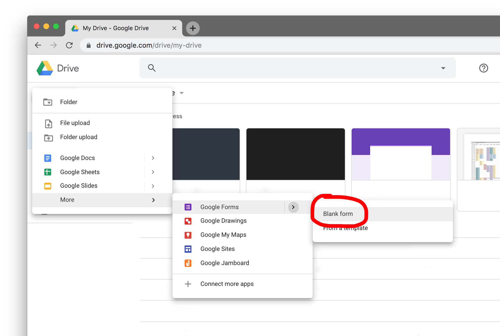
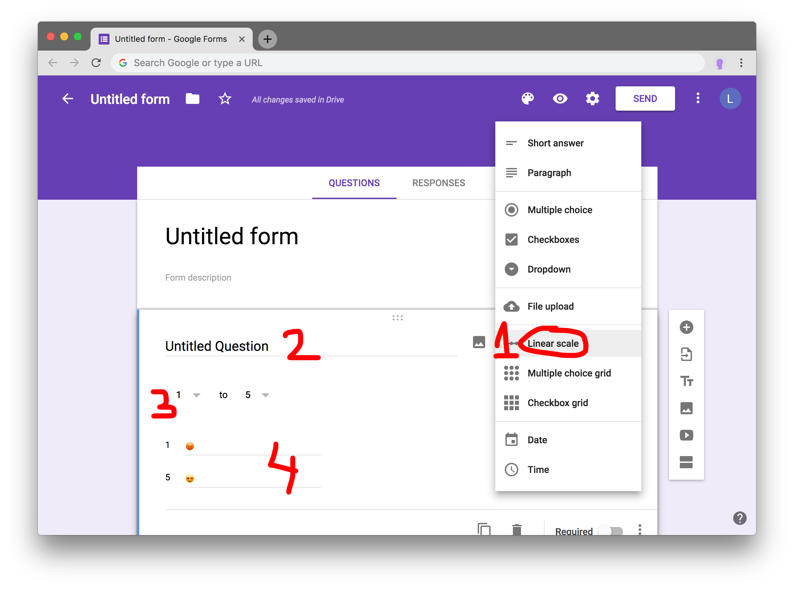
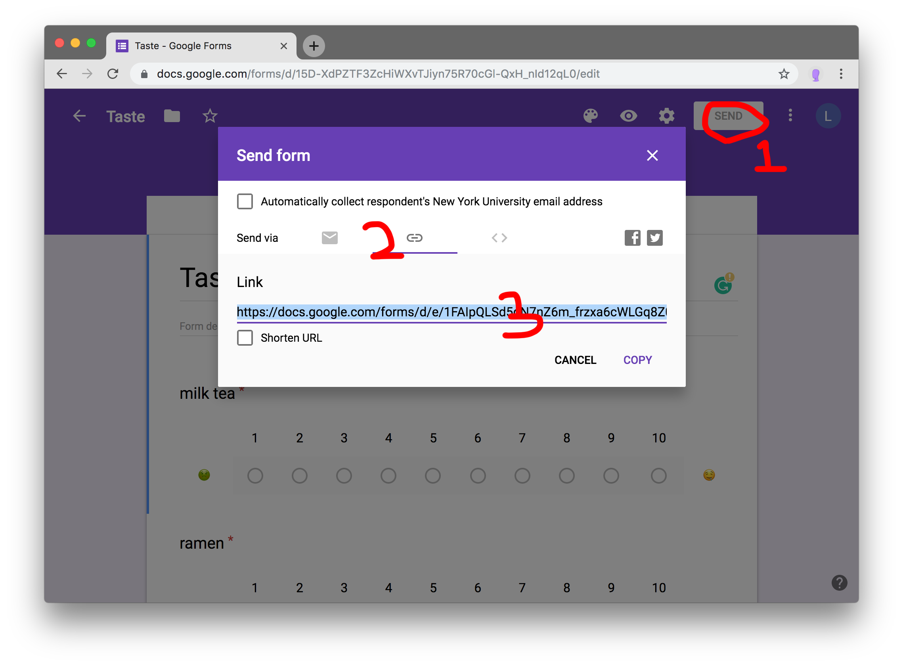
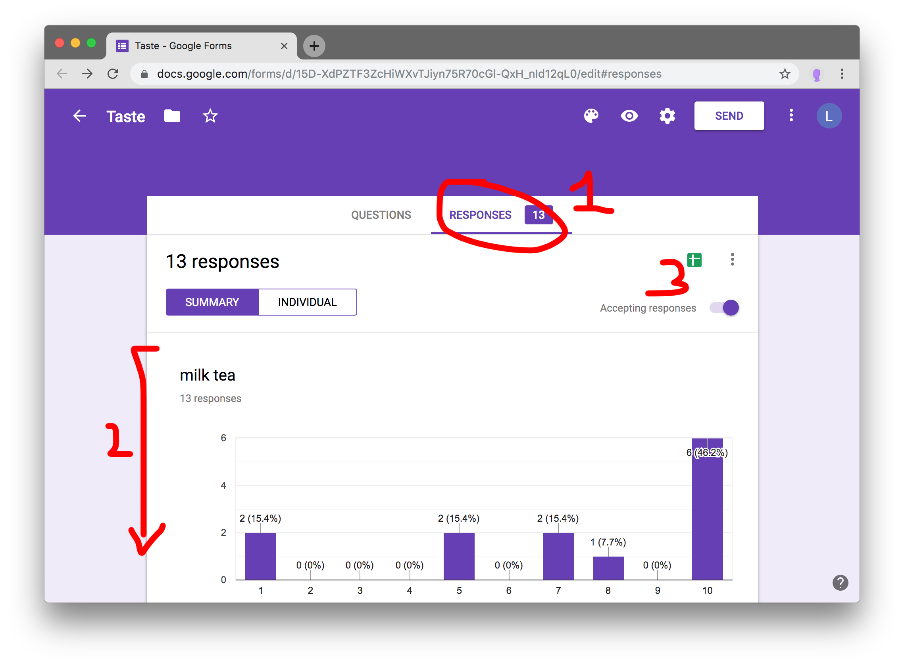
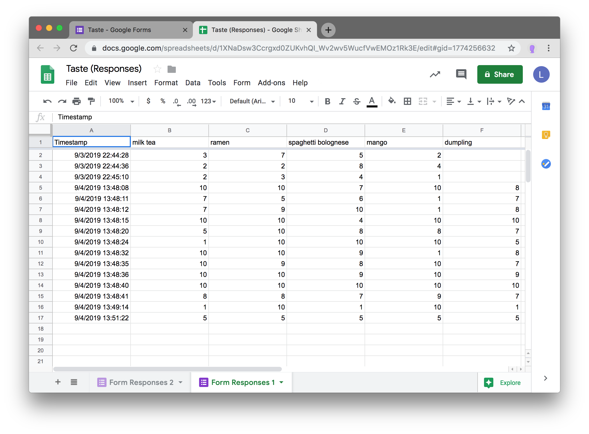
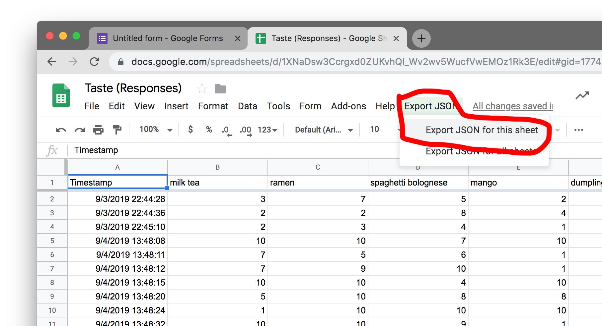

## How to collect data using Google Forms

Google forms are great to collect data from your friends and family very quickly by just sending them a link. There is also an easy way to export the data in json format which is convenient to work with in JavaScript.

I will walk you through the steps.

### Create a Google Form

In your Google Drive, navigate to a folder or create on, then place a new Google Form inside it:



After creating it modify your questions. In this example I am using the "Linear Scale". Each type of questions will ultimately produce slightly different datasets - be aware of that and **test things before you send a questionnaire out to many people**. Below I 1) select the question type, then 2) name the question, 3) set the minimum and maximum values between which our friends can choose and 4) are labels for this minimum and maximum.



You can also define whether a question should be required, this is useful to make sure there are no "holes" in the dataset we are making.
You can add as many questions as you want and also duplicate the ones you have to modify them only slightly.


### Share a Google Form

See here how to get the link that you can share with your friends:



### Access results

As results are coming in you can see them in an Forms interface or in a Google Sheet. Below you see how to get to the Forms interface. If clicking on the Sheet button (3), you will be asked where you want to save the Sheet that is being created. Give it a name and put it into the same folder as your Form file.



The Google Sheet will open automatically



### Exporting JSON datas

After you have collected some data and you want to start writing the code to visualize it, you can follow [these instructions](http://blog.pamelafox.org/2013/06/exporting-google-spreadsheet-as-json.html) on how to export the data in the JSON format.

After you inserted the script as described in the linked instructions, a new button will appear in your Sheet's toolbar that says ``Export JSON``. When you click it for the first time you will need to authenticate and accept that the script you are using can access the content of your Sheet.



Finally your JSON formatted data will show up. Copy it and paste it either into your JavaScript (this is what we do for now) or into a ``data.json`` file. If we use the data in a JavaScript file directly, you will need to assign it as a value to a variable, so type ``let data = `` and then paste the array. Like so:

```javascript
let data = [
    {
        "timestamp": "2019-09-03T14:44:28.271Z",
        "milkTea": 3,
        "ramen": 7,
        "spaghettiBolognese": 5,
        "mango": 2
    },
    {
        "timestamp": "2019-09-03T14:44:36.101Z",
        "milkTea": 2,
        "ramen": 2,
        "spaghettiBolognese": 8,
        "mango": 4
    }
]
```

Now you are ready to use this data in your code!

### Handy function

You can find a function that helps you transform the data into a different structure that you might be interested at the bottom of [Lab1](https://github.com/leoneckert/cdv-fall19/tree/master/labs/lab1#transform-data)
