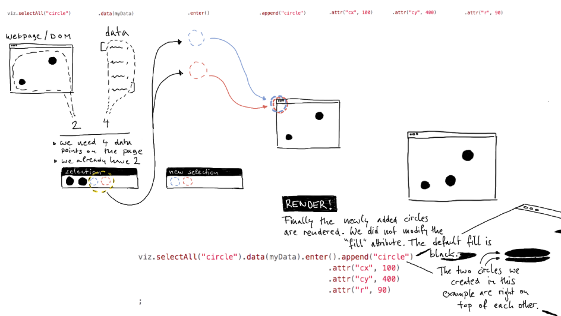

## Lab 3 - Meet D3.js II

#### today's agenda
- useful resources
- homework examples
- incoming data: the enter-selection
- repeat: data function (demo coding)
- modify elements
  - multiple attributes
  - classes
- grouping elements
- text


#### incoming data: the enter-selection

[**LINK TO SLIDES**](https://docs.google.com/presentation/d/123VqEDYcU1tH3jRn1S9-ddSVuJvMESHWJTnnYqkxbS4/edit?usp=sharing)



**add-on**: in D3 we work with selections and modify them in dot-notated chains of methods. You have seen this by now. Let's hold the thought that
- if a selection is **one** element, this element will be modified by all subsequent methods;
- if a selection contains **multiple** elements, subsequent modifications are automatically applied to each of them individually (d3 loops for us, we **do not need to write for loops anymore**)

#### repeat: data function (demo coding)

pre demo: function declaration, argument, function reference, return

demo coding steps (you can copy this into your `script.js` and then we work on each point)

```javascript
// 1. find *real* data (array containing JS objects) in JSON format
// 2. load data (make it *console.loggable* (what a word!) in our script)
// 3. concept: data and datapoint
// 4. make on circle for each datapoint (size and position doesn't matter)
// 5. concept: functions that "return"
// 6. use function to position circles randomly
// 7. realize "who" calls this function / why is there no `()`?
// 8. concept: "passing value into function"
// 9. let's assume: "D3 passes value into the data function"
// 10. if D3 passes a value, how can we receive it?
// 11. use *real* information to impact the x position
// 12. let's assume: "D3 passes another value!"
// 13. how can we receive that value?
// 14. in which ways is D3 making our live easy?
```

#### modify elements

[**HERE IS A LIST OF SVG ELEMENTS**](https://developer.mozilla.org/en-US/docs/Web/SVG/Element)

##### multiple attributes

We can create as many data functions as we want. In each, we can make use of the datapoint (and the i) to affect the visuals appearance of the SVG shapes.

[**Here is a list of many SVG attributes**](https://developer.mozilla.org/en-US/docs/Web/SVG/Attribute). Explore them on your own. Some may only work for specific elements (e.g. the `cx` attribute does not work for a `rect` element), but the reference is making this very clear.

##### classes

Why assign classes?
- to easily style elements in our CSS
- to use the class name in `selectAll()` methods and be more explicit.

Classes are just another attribute of an element. We can assign a class using the `attr()` method:

```javascript
selection.attr('class', 'bar');
```
this assigns the class name '.bar' to each element in the selection.

###### advanced method: ``classed()``
This allows to set multiple classes at once as well as toggle classnames on and off. See [this section](https://github.com/d3/d3-selection#selection_classed) in D3's documentation.


#### grouping elements

In-class live coding.

#### text

`<text>` is a standard svg element which means we create it just the same way as any other shape so far. To see what attributes it needs (assuming we somehow have to treat it differently than a circle for example), we just check any [reference online](https://developer.mozilla.org/en-US/docs/Web/SVG/Element/text). It seems to need `x`, `y`, and content.
