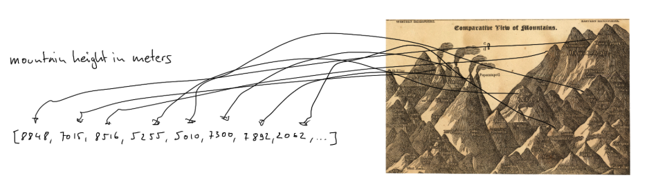
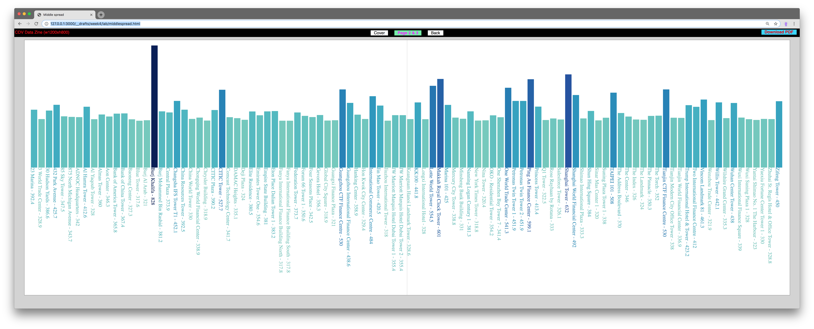
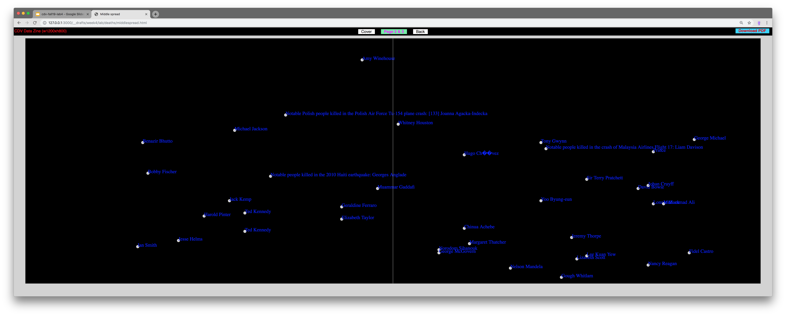

## Lab 4 - D3 Scales

#### today's agenda
- intro to scales (with pictures)
- live coding demo: high buildings
- live coding demo: dead celebrities

#### intro to scales (with pictures)

[**slides here**](https://docs.google.com/presentation/d/1cfJQUk1SqL5Zmr9TLvdFXBKqAVAlS2SQowbhHnQT_Dg/edit?usp=sharing)

#### live coding demo: high buildings

Let's use [this version of the Data Zine coding template](material/buildings-start.zip) (it includes a [data set](material/buildings.json.zip) and some initial code) to build this:

#### live coding demo: dead celebrities

Let's use the [Data Zine coding template]((other/material/datazine-template.zip)) and [this data set](material/celebrity_deaths.json.zip) to build this:

