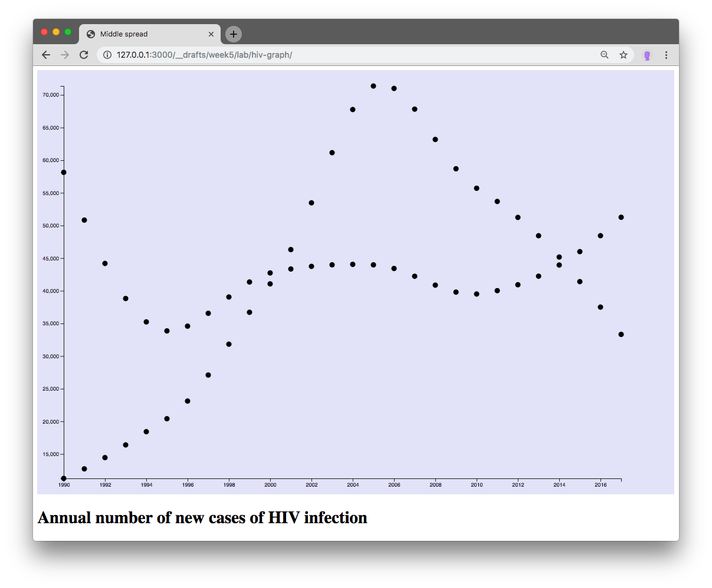

## Lab 5 - Review Day. Old bits, new bits. Scales, data functions, axis, filter method

Today is a review session of the things we have learned so far. We also learn little useful things. We are putting it all together to build one, beautifully coded graph.

#### today's agenda
- Build US/China HIV graph
  - filter function
  - d3.timeParse
  - d3.min, d3.max, d3.extent
  - scales
    - d3.scaleTime
    - d3.scaleLinear
  - axis
  - graph

#### Data

[Our World in Data: Annual number of new cases of HIV infection](https://ourworldindata.org/grapher/new-cases-of-hiv-infection?tab=chart&time=1990..2017)

Please click on the "Data" tab below the graph download a .csv data file.


#### Outcome



<!-- ##### filter function

In these steps, I am not covering every detail because, by now, we are used to the basics, like loading data using `d3.json(...).then(...)` or `d3.csv(...).then(...)` (you might have not used this but it's the same method, just for.csv files).

The dataset we are working with here is huge, it has data for many, many countries, 6468 data points in total. For now, we want to reduce this. How about just visualizing one country, China, for example.

JavaScript offers  extremely useful array methods for the most common things one wants to do with arrays:
- `array.foreach()`: a short hand to loop over each element of an array - I think of this as 'reading' access to the array's values
- `array.map()`: a method to create a new array from an existing one. It let's you loop over each element, rearrange, calculate, add to or take away from the values to construct a new datapoint which is then added to a **new** array that is returned.
- `array.filer()`: a method to create a new array that holds only a subsection of the original one. we can defined a condition which is tested for each element of the old array - if the condition is true for an element, it will be added to the new array, if the condition is false, the element will be ignored.

[Here is a reference for these methods.](https://dev.to/thegamefreak720/how-not-to-be-scared-of-js-array-methods-foreach-map-filter-and-reduce-2c13)

In our dataset, data points look like this:
```json
[

  ...

  {
    Code: "CHN"
    Entity: "China"
    Incidence - HIV/AIDS - Sex: Both - Age: All Ages (Number) (new cases of HIV): "53692.1332112"
    Year: "2011"
  },

  ...

]
```


##### d3.timeParse
##### d3.min, d3.max, d3.extent
##### scales

###### d3.scaleTime
###### d3.scaleLinear

##### axis
##### graph -->
