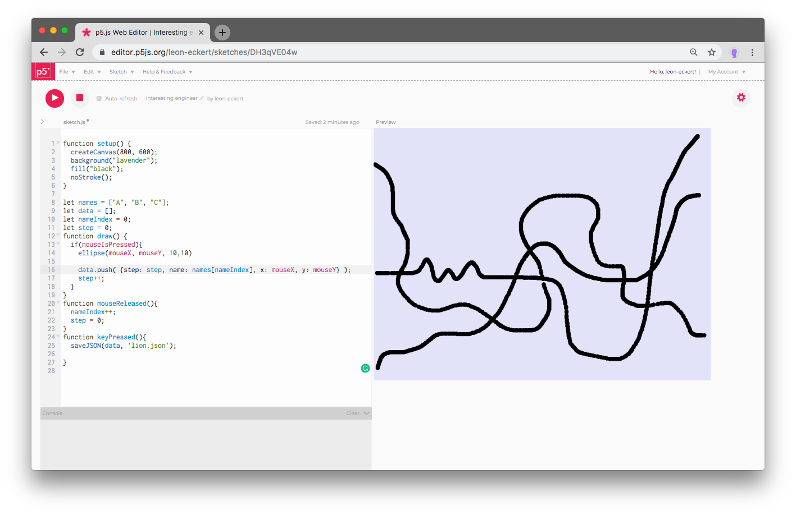
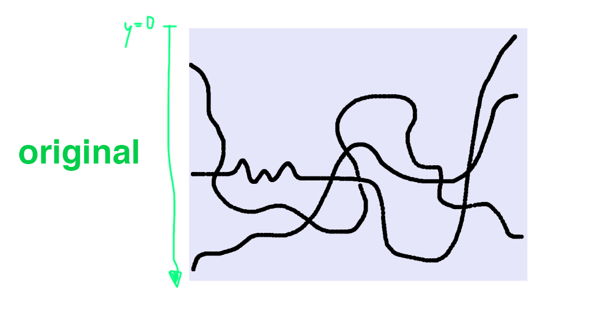
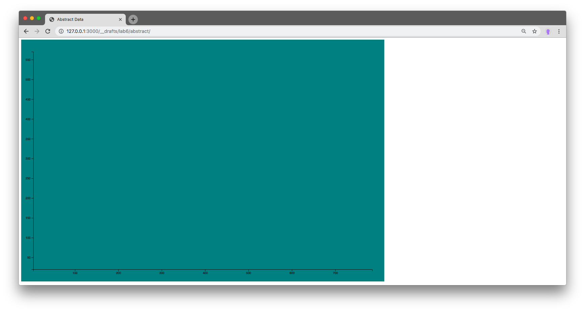
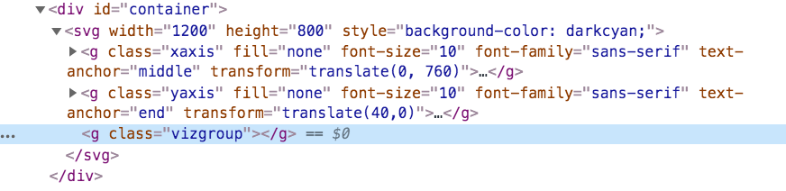
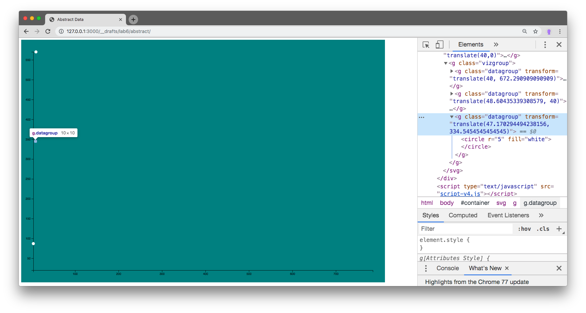
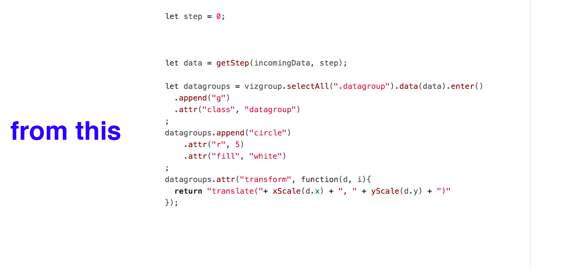

## Lab 6 - introducing: time


#### today's agenda
- Intro: "[*The best stats you have ever seen*](https://www.ted.com/talks/hans_rosling_shows_the_best_stats_you_ve_ever_seen?language=en)", Hans Rosling (start at 2:30)
- Build an abstract, dynamic visualization together
  - [preview 1](https://cdv.leoneckert.com/lab6/preview1)
  - [preview 2](https://cdv.leoneckert.com/lab6/preview2)
  - [preview 3](https://cdv.leoneckert.com/lab6/preview3)
- the dataset
- download project folder

##### Dataset

To aid our learning we will be using a simplified, abstract data set today.

It looks like this:

```javascript
[
  {
    "step": 0,
    "name": "A",
    "x": 4,
    "y": 87
  },
  {
    "step": 1,
    "name": "A",
    "x": 4,
    "y": 87
  },

  ...

  {
    "step": 656,
    "name": "A",
    "x": 785,
    "y": 493
  },
  {
    "step": 0,
    "name": "B",
    "x": 10,
    "y": 570
  },
  {
    "step": 1,
    "name": "B",
    "x": 10,
    "y": 570
  },

  ...

  {
    "step": 594,
    "name": "B",
    "x": 772,
    "y": 160
  },
  {
    "step": 0,
    "name": "C",
    "x": 9,
    "y": 345
  },
  {
    "step": 1,
    "name": "C",
    "x": 9,
    "y": 345
  },

  ...

```

and this is how it was created. You can see the shapes it describes:



##### Download files to start coding

Download a project folder with data and some bits of code [here](material/abstract-viz.zip).

##### Domains, Scales, Axis

###### The Domains for X and Y. What are the minimum and maximum values?

...in p5 (where the data was created), y orientation is flipped from graph convention. Let's think of our graph in this way:




here is the code to get the minimum and maximum of the x value in our data. Copy and paste it into your file and see what it does. ([d3.extent reference](https://github.com/d3/d3-array#extent))

```javascript
let xDomain = d3.extent(incomingData, function(datapoint){
  return datapoint.x;
});
console.log(xDomain);
```

...and here it is for the y value:

```javascript
let yDomain = d3.extent(incomingData, function(datapoint){
  return datapoint.y;
})
console.log(yDomain);
```

###### xScale function: maps from min max of the x to the boundaries of our graph

```javascript
// general padding of our visualization
let padding = 40;
// scale to map from min and max of our x values to the
// boundaries (minus padding) of our svg:
let xScale = d3.scaleLinear().domain(xDomain).range([padding, w-padding]);
```

###### x axis based on the xScale

```javascript
// create axis for this scale
let xAxis = d3.axisBottom(xScale);
// create a groyp to gold the axis elements
let xAxisGroup = viz.append("g").attr("class", "xaxis");
// tell d3 to fill the group with the axis elements
xAxisGroup.call(xAxis);
// position the axis at the bottom of the svg
xAxisGroup.attr("transform", "translate(0, "+ (h-padding) +")");
```

at this point, the graph should look like this:


###### yScale and Axis where low values are at the bottom

```javascript
// note how we flip the orientation (in the range) of our y scale
// to make sure that low y values are at the bottom of the graph
let yScale = d3.scaleLinear().domain(yDomain).range([h-padding, padding]);
let yAxis = d3.axisLeft(yScale);
let yAxisGroup = viz.append("g").attr("class", "yaxis");
yAxisGroup.call(yAxis);
yAxisGroup.attr("transform", "translate("+padding+",0)");
```



##### Graph
For organizational reasons, we make a group to hold everything to do with the actual visualizations:

```javascript
let vizgroup = viz.append("g").attr("class", "vizgroup");
```



###### which data are we visualizing? Pick a subset:

```javascript
let step = 0;
let data = getStep(incomingData, step);
console.log(data);
```

###### bind data, append groups and shapes to enter selection

Note, here we create elements for the datapoints that **ENTER**. Then we append groups/shapes to them.

```javascript
let datagroups = vizgroup.selectAll(".datagroup").data(data).enter()
  .append("g")
  .attr("class", "datagroup")
;
datagroups.append("circle")
    .attr("r", 5)
    .attr("fill", "white")
;
datagroups.attr("transform", function(d, i){
  return "translate("+ xScale(d.x) + ", " + yScale(d.y) + ")"
});
```



Play with the value of the step variable to see different positions:

```javascript
let step = 423;
```

###### Make it move

Now starts the fun. First let's put all the part of hour code that actually draw the shapes into a function. Note we also call the function right there below the step variable. So this code does the exact same as the previous version:

```javascript
// first we set which step to visualize
let step = 1;
// then we call the function that puts it onto the graph
drawViz();
// oh, and here we define that function
function drawViz(){
  let data = getStep(incomingData, step);

  let datagroups = vizgroup.selectAll(".datagroup").data(data).enter()
    .append("g")
    .attr("class", "datagroup")
  ;
  datagroups.append("circle")
      .attr("r", 5)
      .attr("fill", "white")
  ;
  datagroups.attr("transform", function(d, i){
    return "translate("+ xScale(d.x) + ", " + yScale(d.y) + ")"
  });
}
```

the following gif is just to illustrate further what we just did, **don't do it twice**:



###### What happens if we change the step value, then call the draw function again:

```javascript
let step = 1;
drawViz();
setTimeout(function(){
  step = 100;
  drawViz();
}, 4000);
```

...nothing? to understand what's going on, let's add some console.logs in the `drawViz` functions:

```javascript
function drawViz(){
  console.log("running");
  let data = getStep(incomingData, step);
  console.log("data:");
  console.log(data);

  ...

}
```

what do you see? the data changes, but the graphics do not. Why could that be?

###### enter & update selection

Let's modify this part of the function:

```javascript
function drawViz(){

  ...

  // after binding the new data, d3 thinks: we have 3 datapoints
  // on the page, and have 3 datapoints in the incoming data.
  // Therefore no new elements need to enter
  let datagroups = vizgroup.selectAll(".datagroup").data(data);
  // if we extract only the entering elements the
  // "incomingDataGroups" selection will be empty the second time
  // this function is called, because elements are already on
  // the page and only need to be updated
  let incomingDataGroups = datagroups.enter()
    .append("g")
    .attr("class", "datagroup")
  ;

  incomingDataGroups.append("circle")
      .attr("r", 5)
      .attr("fill", "white")
  ;

  incomingDataGroups.attr("transform", function(d, i){
    return "translate("+ xScale(d.x) + ", " + yScale(d.y) + ")"
  });

  // here we deal with the elements that need to be UPDATED
  datagroups.attr("transform", function(d, i){
    return "translate("+ xScale(d.x) + ", " + yScale(d.y) + ")"
  });
}
```

Great, now we see the update, but let's check if d3 knows which data point corresponds to which across steps. We *test* D3's knowledge by giving the datapoint a label:

```javascript
// this part is already in your code
incomingDataGroups.append("circle")
    .attr("r", 5)
    .attr("fill", "white")
;
// ADD only this part
incomingDataGroups.append("text")
    .text(function(d){
      return d.name;
    })
;
```

and, let's shuffle the array of data every time we create the subset:

```javascript
// this part is already in your code
console.log("running");
let data = getStep(incomingData, step);
// ADD only this part
d3.shuffle(data);
console.log("data:");
console.log(data);
```

and!!! we add a transition to highlight D3's association of existing and new data points. Adjust this line in your code:
```javascript
datagroups.transition().attr("transform", function(d, i){
  return "translate("+ xScale(d.x) + ", " + yScale(d.y) + ")"
});
```

check on the console how the array is shuffled. Now, what do we see in the visualization? **D3 has no clue that point A of step 0 is realated to point A in step 231.**

###### Data keys

if we define keys of datapoint, D# can correlate which updated datapoint corresponds to which element that is already on the page. A key needs to be a unique feature of the datapoint. in our case, the "name" is suited perfectly. ([See this sections of the D3 reference](https://github.com/d3/d3-selection#selection_data))

Adjust this line in your code:

```javascript
let datagroups = vizgroup.selectAll(".datagroup").data(data, function(d){
  // we return the value that should act as the datapoints key
  return d.name;
});
```

now we are good. The rest is for us to play. Use a `d3.interval` to cycle through all the steps or a `Math.random()` to jump randomly. Also, check what happens if you update the scales and axis in the `drawViz` function, too.  
