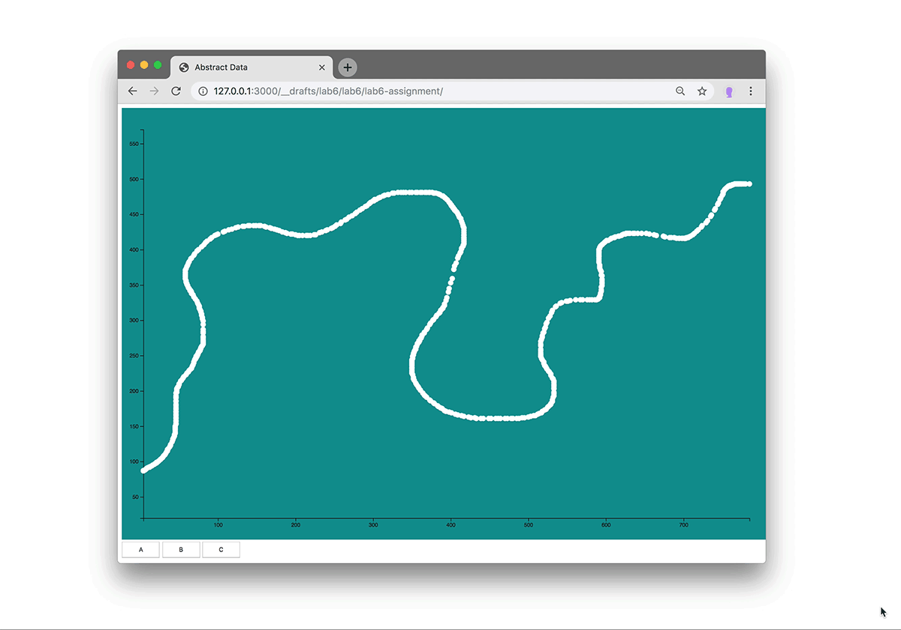

### Lab 6: assignment

Add to the website we have built in [Lab 6](..). At any given time, all the data points with the same `name` should be on display. Put buttons into place that let the viewer select the points of which name should be shown. Transition between the selections.

###### Hints
You will need to write a function similar to getStep that filters by name, not by step. Then you can create more functions inside `getData()`, one for each name. Bind these functions to 'click' events of buttons on the page. You can use `addEventListener` to do that. Below is a screenshot of what the result should roughly look like, but please be creative. You can also add more transitions (color, size, etc.).

