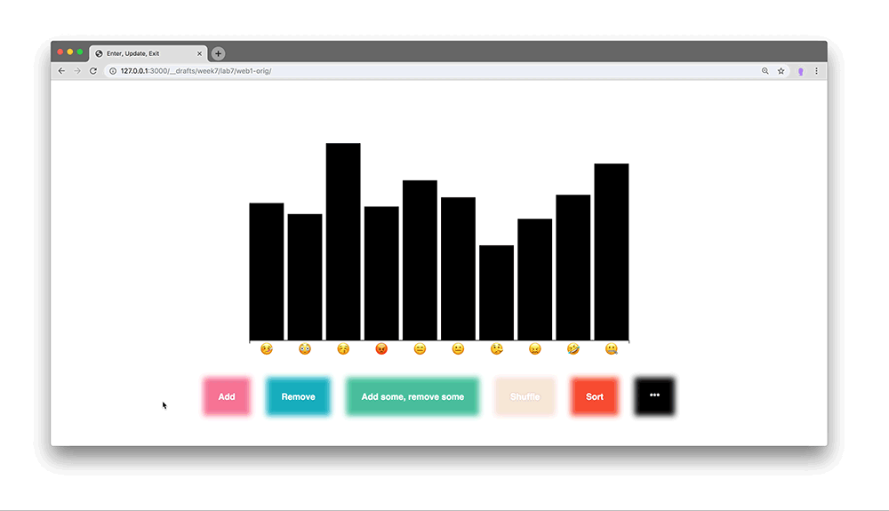
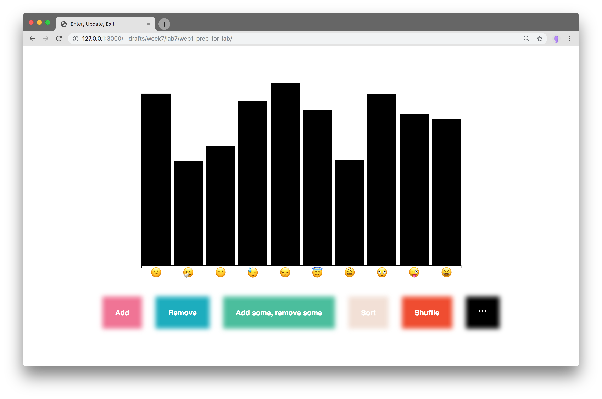
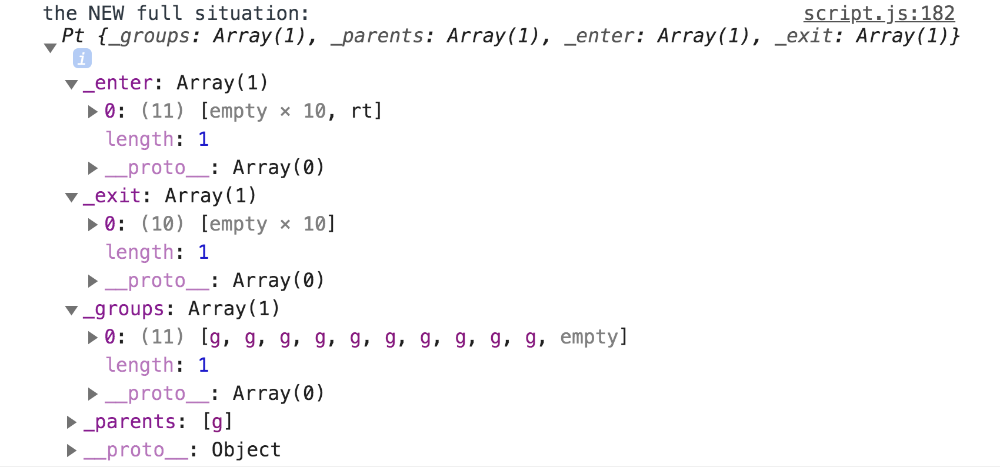
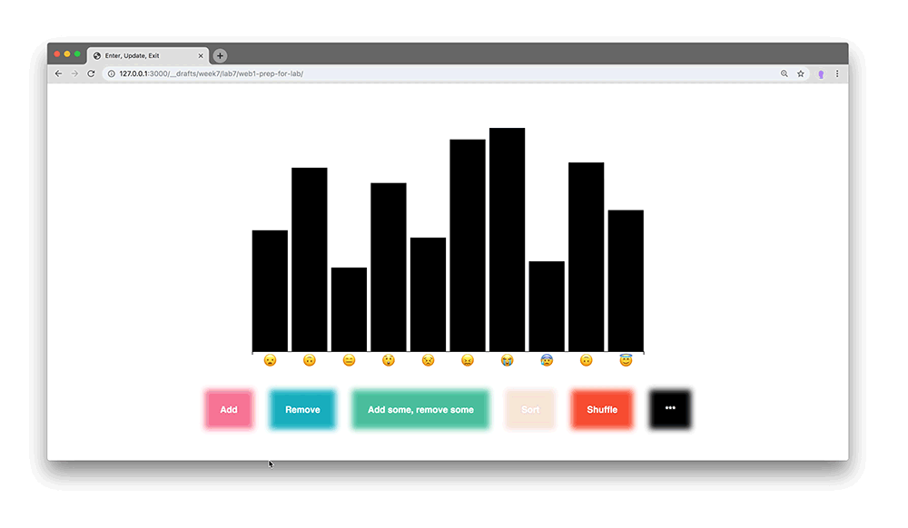

## Lab 7 - Dynamic Visualization Part 2

Today we learn more about the
- update
- enter
- exit
concept in D3.

Start with [these files](material/lab7-start.zip). We will build this:



### step 1
after uncommenting code in `dataManager.js`, we give functionality to the buttons on the page. This happens at the bottom of `script.js`
```javascript
// binding functions to the buttons on the page
// the functions we use to do the actual work are defined in dataManager.js
function add(){
  addDatapoints(1);
}
document.getElementById("buttonA").addEventListener("click", add);

function remove(){
  removeDatapoints(1);
}
document.getElementById("buttonB").addEventListener("click", remove);

function removeAndAdd(){
  removeAndAddDatapoints(1,1);
}
document.getElementById("buttonC").addEventListener("click", removeAndAdd);

function sortData(){
  sortDatapoints();
}
document.getElementById("buttonD").addEventListener("click", sortData);

function shuffleData(){
  shuffleDatapoints();
}
document.getElementById("buttonE").addEventListener("click", sortData);
```

### step 2
the basics (i'll put them below the console.logs at the top of `script.js`)
```javascript
// global variables that we need at various spots:
let w = 800;
let h = 500;
let padding = 50;

// put the svg onto the page:
let viz = d3.select("#container")
  .append("svg")
    .style("width", w)
    .style("height", h)
;
```

### step 3

next comes the x scale and x axis. test line by line what this code is doing:
```javascript
// X SCALE
// we use a band scale
//
// reference: https://github.com/d3/d3-scale#band-scales
// example: https://observablehq.com/@d3/d3-scaleband
//
// this is a useful scale when associating names (not values) with spots
// on the x axis. we don't map a range of values to another range of values,
// but a fixed set of names (the keys of our data points) to
// a range (pixel values along the x axis)
//
// first we need an array with the keys only:
let allNames = data.map(function(d){return d.key});
// check it:
console.log(allNames);
// now we as d3 to give us our custom scale
// we say "hey d3, here is a list of names (keys (the domain)), I want a function that
// returns a number (pixel location on the x axis (the range)) for each of the names.
// oh, and could you make sure that this functions calculates in some
// distance (passingInner) between each of thos points (bands)?"
let xScale = d3.scaleBand()
    .domain(allNames)
    .range([padding, w-padding])
    .paddingInner(0.1)
;
// create a visual axis corresponding to the scale.
let xAxis = d3.axisBottom(xScale)
// this is a tricky one.... by default the axis would show the scales domain (the unique keys)
// ...in our case we want emojis to show. This situation hardly comes up,
// that's why I just wrote this one-liner for you:
xAxis.tickFormat(d=>{return data.filter(dd=>dd.key==d)[0].name;});
// create a group to hold all the acis elements
let xAxisGroup = viz.append("g").classed("xAxis", true);
// tell d3 to put the axis into place
xAxisGroup.call(xAxis);
// modfy the axis label (the emoojis) size
xAxisGroup.selectAll("text").attr("font-size", 24).attr("y", 9);
// get rid of the little tick lines
xAxisGroup.selectAll("line").remove();
// bring axis to the correct y position
xAxisGroup.attr("transform", "translate(0,"+ (h-padding) +")")
```

### step 4
y scale, but no visible x axis.
```javascript
// Y SCALE
// we will not show a y axis in this graph, but still need a scale
// to make sure our bars have heights that fit the window. It's
// familiar linear scale.
let yMax = d3.max(data, function(d){return d.value});
// I decided not to use the minimum value of the dataset,
// because otherwise the smallest value's bar would always be 0 pixels
// high and therefore invisible.
yDomain = [0, yMax];
// "hey d3 i need a linear scale please. yeah! I want to supply a value
// to it that is between 0 and yMax and want one back that fits between
// my graph's paddings. Cheers!"
let yScale = d3.scaleLinear().domain(yDomain).range([0, h-padding*2]);
```

### step 5
group to hold the graph:
```javascript
// the ACTUAL GRAPH
// before we get to the actual graph, we make a group element into which to
// put all visual graph things:
let graphGroup = viz.append("g").classed("graphGroup", true);
// btw, this:
// .classed("graphGroup", true);
// is almost equivalent to
// .attr("class", "graphGroup");
// but slightly more advanced. you can find a description here:
// https://github.com/d3/d3-selection#selection_classed
```

### step 6 - it gets serious, pay attention!
```javascript
// now comes the interesting part, WATCH OUT! i'll go slow
// we have the page (with nothing on it) and we have data
// we *toss* it both to D3 and ask what's the situation.
// excuse the lack of a better variable name:
let theSituation = graphGroup.selectAll(".datapoint").data(data);
// note, we do not use ".enter()" for now. let's have a close look
// at just this (the situation) for now
// as we have learned, D3 did some kind of calculation here, some weighing
// of what is on the page already and what needs to go there.
// have a close look at this console.log:
console.log("the full situation:", theSituation);
// note the reference to enter, exit and group in the object
// those three are the "full situation" / everything that's on the table.
// they comprises elemnents that are about to enter (in this case 10),
// elements that are on the page already and will be updated and elemnents
// that don't have any associated datapoint anymore and need to exit.
// out of this "siutation" we can pick those three subsections and decide
// precisely what to do with the, e.g. how should new elements enter?
// should they come from the bottom? slowly fade in? - ours to decide
// how should updating elements change their size, color, position etc.?
// and the exiting ones, rather than just dissapearing, how about they
// fade out?
// I'll act this out more understandable in person, I promise ;-)
```


### step 7 - extracting enter and exit selection
```javascript
// out of this "full situtation" we will now extract the subselections,
// the entering elements and the exiting ones:
let enteringElements = theSituation.enter();
let exitingElements = theSituation.exit();
// and again, look closely:
console.log("enteringElements", enteringElements);
console.log("exitingElements", exitingElements);
// note how we now only deal with a "_groups" thing,
// in the enteringElements object, the "_groups" array holds the
// empty placeholder elements for the elements that are about to enter
// equally, in the exitingElements, the "_groups" array holds the elements
// that ARE on the page, but must leave because no datapoint is their to
// match them.
// here is how i see it, we start with the full situation - all the elements
// that we are deling with. from that, we extract the entering ones (... and
// do something with them), we also exract the exiting one (...and treat those
// differently, too) and then? What are we left with? the UPDATING elements!
// they are in the "_groups" array we saw in the very beginning inside
// "theSituation". For now, hold the thought that we are dealing
// with three subsections of elements: entering ones, exiting ones, and updating ones.
// hopefully this will get clearer as we go on.
```

### deal with entering elements:
```javascript
// as you can see, there is nothing on the page yet. And the previous console.logs
// confirm that there is no elements updating, none are leaving, we only have things enter.
// let's deal with them right now:
// make a group for each datapoint
let dataGroups = enteringElements.append("g").classed("datapoint", true);
// position the group along the x axis (check the inspector tool to see
// what we are doing):
dataGroups.attr("transform", function(d, i){
  return "translate("+ xScale(d.key)+ "," + (h - padding) + ")"
});
// then append rectangles to them and position/size them:
dataGroups
  .append("rect")
    .attr("width", function(){
      // the scaleBand we are using
      // allows us to as how thick each band is:
      return xScale.bandwidth();
    })
    .attr("height", function(d, i){
      // the idea is that we make the bar
      // as high as dictated by the value...
      return yScale(d.value);
    })
    .attr("y", function(d,i){
      // ...and then push the bar up since it
      // is drawn from top to bottom
      return -yScale(d.value);
    })
    .attr("fill", "black")
;
```
Now we have something to look at!


### CHANGE DATA!
Now let's move into the `add()` function. When we click the first button, a datapoint is added to our data array. Let's try to slowly redraw our graph inside the `add()` function

#### scales first
scales are needed for the other things to... scale well:
```javascript
// we add new code below:
console.log("new data", data)

// before we get back to dealing with the bars, we need to update
// out scales (and axis) to match the enw data.
// scales are like machines we get custom made. and like machines,
// after using them for a bit, we can adjust their inner workings
// here we adjust the xScale we already defined and used. all
// we want to change about it is the domain.
// we get the updated list of keys for our data set that has changed:
allNames = data.map(function(d){return d.key});
// and adjust the domain of xScale:
xScale.domain(allNames);
// done, the xScale is "fixed" and ready to help us to position elements
// for our new data
```
#### next, the axis (and y scale);

```javascript
// as you can see, we only adjust selectively the bits that depend
// on our data. the same is true for the axis:
xAxis = d3.axisBottom(xScale); //we adjust this because it uses the new xScale
xAxis.tickFormat(d=>{return data.filter(dd=>dd.key==d)[0].name;}); // we adjust this because it uses the new data
xAxisGroup.call(xAxis).selectAll("text").attr("font-size", 18); // we adjust this to bring the new axis onto the page

// y scale...
yMax = d3.max(data, function(d){return d.value});
yDomain = [0, yMax+yMax*0.1];
yScale.domain(yDomain);

// do you see how the axis adjusts to the new data at this point? you can animate
// this transition inside the statement where you use ".call(xAxis)"...
```
animate the transition of the x axis. change the corresponding line in the previous code snippet to
```javascript
xAxisGroup.transition().call(xAxis).selectAll("text").attr("font-size", 18); // we adjust this to bring the new axis onto the page
```

#### update the bars


```javascript
// we add new code below:
console.log("new data", data)
// what we essentially do now is the following:
// each element on the page is associated with one datapoint
// of the OLD data array. With our new data, we will now overwite
// those associations. let's start by setting up the full situation:
theSituation = graphGroup.selectAll(".datapoint").data(data);
// note, we don't need "let" because the variable already exists
console.log("the NEW full situation:", theSituation);
// look at this, it's slightly unexpected at first, but fold out
// the enter, exit and _group ("update") subsections:
// you will see that enter has.... ONE element! it's the one we
// just added to the array!!
// exit has zero elements, no elements is leaving, because we reuse
// all the elements that are on the page and...
// ...update them! as is seen in the _group ("update") array where there is 10 elements (the ones that are on the page already)
// in other words: "10 elements are on the page, we would like to show 11 (amount of points in our data). therefore we reuse the 10 (update them) and add one more (it enters)".
// WOW
// so cool :D
// again, we can now exactly define, how each subgroup should
// behave
```



#### the updating bars (part 1)
```javascript
// in the end, the incoming bar will appear on the right side. for that
// to look great, let's move over the updating elements first.
// to recap, we extract the entering elments like so:
enteringElements = theSituation.enter();
// and the exiting ones like so:
exitingElements = theSituation.exit();
// note: i don't use "let" because this variables already exists
// ...after extracting those subgroups, what's left in theSituation
// are the elements that update.
// let's try it:
theSituation.attr("transform", function(d, i){
  return "translate("+ xScale(d.key)+ "," + (h - padding) + ")"
});
// try it
// oh my, it works. You can animate the transition in the same way as you did
// with the x axis before
```
to animate the transition add this:
```javascript
theSituation.transition().duration(1000).attr("transform", function(d, i){
  return "translate("+ xScale(d.key)+ "," + (h - padding) + ")"
});
```
note, i added a new word, `duration()`, you can guess what it does.

#### the updating bars (part 2)
update some more attributes:
```javascript
// we aren't done with the updating setion yet
// the width needs to adjust, and even the height (as incoming data points MIGHT
// set a new maximum value and every other bar goes down a little)
theSituation.select("rect")
 .transition()
 .delay(1000)
 .duration(200)
 .attr("width", function(){
    return xScale.bandwidth();
 })
 .attr("y", function(d,i){
   return -yScale(d.value);
 })
 .attr("height", function(d, i){
   return yScale(d.value);
 })
;
// first note, I added a new feature, the .delay() impact the transtition, you can guess
// in which way.
// second, again, we only update the things that are impacted by the new data situation
```


#### entering data!

```javascript
// lastly, we can deal with the elements that enter
// we already extracted the enteringElements from the situation above
// what do we want to do with incoming elements?
// much the same we always do
// we append a group to the empty placeholder:
let incomingDataGroups = enteringElements
  .append("g")
    .classed("datapoint", true)
;
// position the groups:
incomingDataGroups.attr("transform", function(d, i){
  return "translate("+ xScale(d.key)+ "," + (h - padding) + ")"
});
// and append rectangles
incomingDataGroups
  .append("rect")
    .attr("width", function(){
      return xScale.bandwidth();
    })
    .attr("y", function(d,i){
      return -yScale(d.value);
    })
    .attr("height", function(d, i){
      return yScale(d.value);
    })
    .attr("fill", "black")
 ;
 // works, but looks boring! let's transition from no height
 // at all to the actual height and from a different color towards
 // black.
 ```

 we can set initial attributes before the transition and then change them *on the other side* of it. Adjust your code:
 ```javascript
 incomingDataGroups
   .append("rect")
     .attr("y", function(d,i){
       return 0;
     })
     .attr("height", function(d, i){
       return 0;
     })
     .attr("width", function(){
       return xScale.bandwidth();
     })
     .attr("fill", "#F27294")
     .transition()
     .delay(1200)
     .duration(2000)
     .attr("y", function(d,i){
       return -yScale(d.value);
     })
     .attr("height", function(d, i){
       return yScale(d.value);
     })
     .attr("fill", "black")
  ;
```
