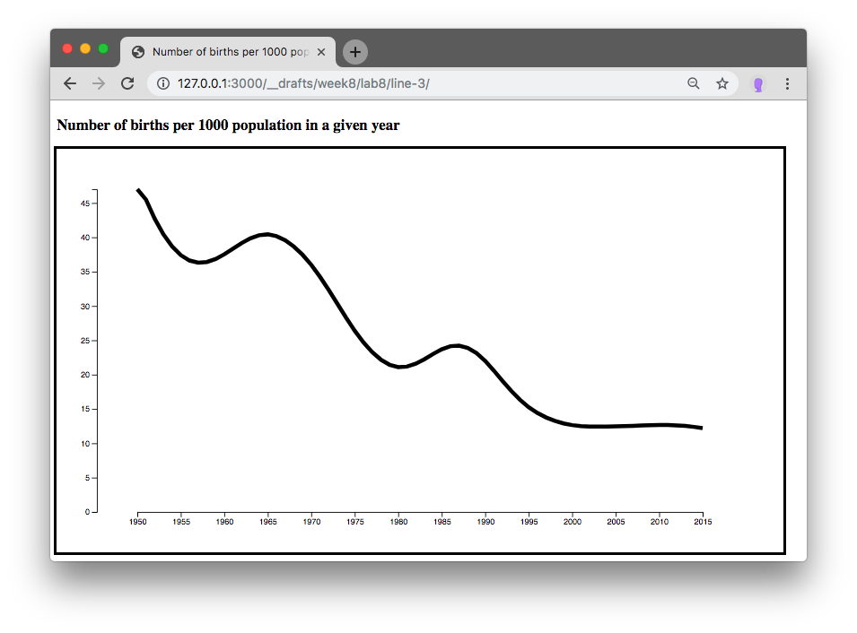
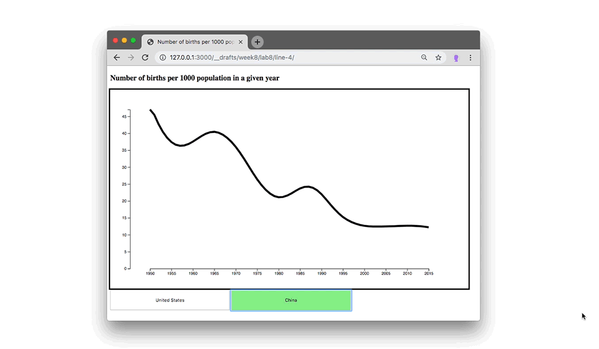

## Generators, Components & Layouts

- Review "Enter, Update, Exit" Coding exercise
  - minimal example
    - [online example](https://cdv.leoneckert.com/keys/mini-transition-example/)
    - [code](mini-transition-example/) & [download](mini-transition-example/mini-transition-example.zip)
  - review data `keys`
    - **Without** Keys
      - [online example](https://cdv.leoneckert.com/keys/mini-transition-example-no-keys/)
      - [code](mini-transition-example-no-keys) & [download](mini-transition-example-no-keys.zip)
    - **With** Keys
      - [online example](https://cdv.leoneckert.com/keys/mini-transition-example-keys/)
      - [code](mini-transition-example-keys) & [download](mini-transition-example-keys.zip)
    - Mike Bostock's [description](https://bost.ocks.org/mike/constancy/)
- Descriptions: Generators, Components & Layouts
- Line Exercise
  - from points (circles) to line
  - real data
  - line transition

### Descriptions: Generators, Components & Layouts
The following descriptions are taken from [*D3.js in Action, Second Edition*](https://livebook.manning.com/book/d3js-in-action-second-edition/about-this-book/) by Elijah Meeks.

> Generators
>
> D3 generators consist of functions that take data and **return the necessary SVG drawing code** to create a graphical object based on that data. For instance, if you have an array of points and you want to draw a line from one point to another, [...] a few D3 functions can help you with this process. These generators simplify the process of creating a complex SVG<path> by abstracting the process needed to write a <path>d attribute.

examples:
- [d3.line](https://github.com/d3/d3-shape/blob/v1.3.5/README.md#line)
- [d3.area](https://github.com/d3/d3-shape/blob/v1.3.5/README.md#area)
- [d3.arc](https://github.com/d3/d3-shape/blob/v1.3.5/README.md#arc) (used to create the pie pieces of pie charts)
- [d3.pie](https://github.com/d3/d3-shape/blob/v1.3.5/README.md#pie)

> Components
>
> In contrast with generators, which produce the d attribute string necessary for a <path> element, components **create an entire set of graphical objects** necessary for a particular chart component. The most commonly used D3 component [...] is d3.axis, which creates a bunch of <line>, <path>, <g>, and <text> elements that are needed for an axis based on the scale and settings you provide the function.

examples:
- [d3.axis](https://github.com/d3/d3-axis/tree/v1.0.12)
- [d3.brush](https://github.com/d3/d3-brush/blob/v1.1.2/README.md#brush)

> Layouts
>
> In contrast to generators and components, D3 layouts can be rather straightforward, like the pie chart layout, or complex, like a force-directed network layout. Layouts take in one or more arrays of data, and sometimes generators, and **append attributes to the data** necessary to draw it in certain positions or sizes, either statically or dynamically.

examples:
- [d3.tree](https://github.com/d3/d3-hierarchy/blob/v1.1.8/README.md#tree)
- [d.cluster](https://github.com/d3/d3-hierarchy/blob/v1.1.8/README.md#cluster)

### line exercise

start by downloading [these](material/line-exercise.zip) files.

##### `line-1` folder
1. draw one circle for each datapoint
  - map `laughs` on the x axis and `mood` on the y axis.
  - create a `getX` and `getY` data function to define the location (like we did back in the days)
  - space the circles to use the whole svg
    - you can do this by multiplying the relevant values inside the `getX` and `getY` functions.
2. we explore d3's `line` method together.

##### `line-2` folder
1. make yourself familiar with the code and the data.
2. apply what you just learned about the `d3.line` generator to create this:
  
3. next try to transition from one data to the other (the data I supplied contains data for the USA and CHINA)
  
