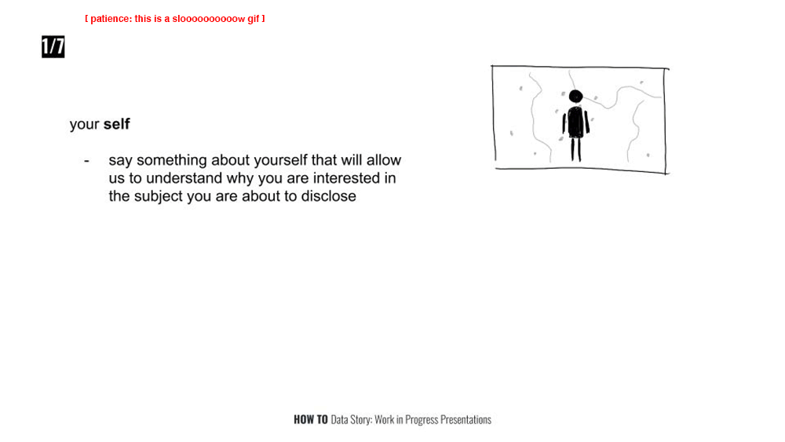

### Current Assignments

I try to copy assignments from the [main page](../../) to this place. Please point out to be if I fail to keep it updated. Thanks!

##### Due Monday (2019/11/11):
- On Monday, November 11th, your **Data Story: Work in Progress Presentations** is due.
  - you picked a dataset, for next week, research thoroughly about its **context**, its **origin**, the **information it does/does not carry**, the **insights** it might provide and **controversies** it could fuel.
  - prepare a 4 minute presentation
    - take [this]((https://docs.google.com/presentation/d/1Tf8uFBpV1EsGzS-fqMbOSfryAwuczf9w6FIsmHcwyT4/edit?usp=sharing)) as a guide (see also below gif)
    - if you plan to **not** use Google Slides, please let me know by Friday
    - share a link to your slides with me by 11/11 noon.
    - pro tip: avoid too much text on your slides, it really does make them less clear. slides do not need to speak for themselves but illustrate what you have to say.

##### Due Wednesday (2019/11/13):
- Create a paper prototype for your Data Story Project
  - Download template here: [horizontal](../material/horizontal-data-story-prototype.pdf) or [vertical](../material/vertical-data-story-prototype.pdf) layout.
    - Print the in **A3 Format**.
    - You can use multiple printouts for different pages of your website.
  - Use the space around to browser for annotations and further explanations of your website.
    - this should cover interaction, transition, movements, sounds, special effects.
  - Scan the prototype when you are finished, upload it to your repository and submit a link to the class wiki.

<!-- ##### Due Wednesday (2019/11/06):
- Create a "quick and dirty" visualization using the data you have chosen to use for your project.
  - The focus of this exercise is to make your data workable.
  - Include at least one transition.
  - Be as simple or fancy as you desire in the design of your visualization. -->

<!-- ##### Due Monday (2019/11/04):
- Read [*The Messy Truth About Social Credit*](https://logicmag.io/china/the-messy-truth-about-social-credit/) from Logic Magazine's [China Issue](https://logicmag.io/china/) (recommended beyond this particular reading).
  - Note down your thoughts and opinions to discuss them next class.
- Prepare a short presentation about your project's subject for next classes:
  - Each of you will present their topic in this format:
    - 5 slides that can only contain images
    - 20 seconds per slide as you talk along explaining your interest and what you hope to make visible through your project
    - practice your text and its timing (email it to me by Sunday if that helps)

- Next week's Group Research Presentation:
  - Kennedy, Sarah & Thomas
  - find the resources for your group research [here](/group-research/automating-inequality). -->

<!-- ##### Due Wednesday (2019/10/23):
- Read carefully through the Lab, maybe multiple times.
- Finish the website we have started to build in class making all the buttons functional
  - the last button is a *wild* one, make it to unexpected things
  - when you are done, push and submit to the class wiki
- when you have mastered it
  - please be playful, transitions are fun, change colors, positions, text, and more.
  - the transition can also animate differently, take a look here (do this after you have achieved all the other parts):
    - [transitions](https://github.com/d3/d3-transition)
    - [transition ease](https://github.com/d3/d3-transition#transition_ease)
    - [ease functions](https://github.com/d3/d3-ease)
    - [ease examples](https://observablehq.com/@d3/easing-animations?collection=@d3/d3-ease)

 -->
