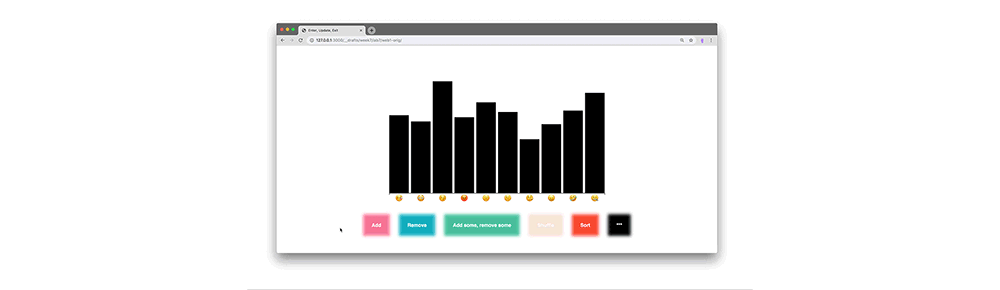

### Current Assignments

I try to copy assignments from the [main page](../../) to this place. Please point out to be if I fail to keep it updated. Thanks!

##### Due Wednesday (2019/11/06):
- TBD

##### Due Monday (2019/11/04):
- Read [*The Messy Truth About Social Credit*](https://logicmag.io/china/the-messy-truth-about-social-credit/) from Logic Magazine's [China Issue](https://logicmag.io/china/) (recommended beyond this particular reading).
  - Note down your thoughts and opinions to discuss them next class.
- Prepare a short presentation about your project's subject for next classes:
  - Each of you will present their topic in this format:
    - 5 slides that can only contain images
    - 20 seconds per slide as you talk along explaining your interest and what you hope to make visible through your project
    - practice your text and its timing (email it to me by Sunday if that helps)

- Next week's Group Research Presentation:
  - Kennedy, Sarah & Thomas
  - find the resources for your group research [here](/group-research/automating-inequality).

<!-- ##### Due Wednesday (2019/10/23):
- Read carefully through the Lab, maybe multiple times.
- Finish the website we have started to build in class making all the buttons functional
  - the last button is a *wild* one, make it to unexpected things
  - when you are done, push and submit to the class wiki
- when you have mastered it
  - please be playful, transitions are fun, change colors, positions, text, and more.
  - the transition can also animate differently, take a look here (do this after you have achieved all the other parts):
    - [transitions](https://github.com/d3/d3-transition)
    - [transition ease](https://github.com/d3/d3-transition#transition_ease)
    - [ease functions](https://github.com/d3/d3-ease)
    - [ease examples](https://observablehq.com/@d3/easing-animations?collection=@d3/d3-ease)

 -->
